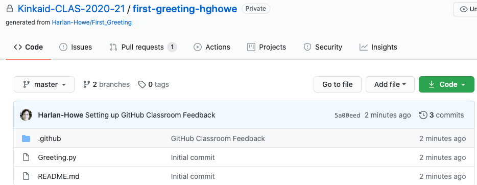

APCS	August 27, 2020

## Brute Force Graphing ##

Although we will certainly be playing with graphics later, for now we are constrained a bit to ASCII art. I'd like for you to consider writing a program that you can use to graph a linear function **in the first quadrant**, using only the text console.

Your program will use a Scanner to ask the user for four pieces of information: 

*   The domain (i.e., the max "x" value to graph) - an int.
*   The range (i.e. the max "y" value to graph) - an int.
*   The y-intercept - an int.
*   The slope - a double. 

It will then generate a graph, composed of "|" and "-" for the axes, " " for white space, and "*" for the line you are drawing. Print the max x- and y-values at the end of the axes. (Hint: Most of the time, you will be printing a space.) 

Because the line may consist of non-integer values, this will necessarily be an _approximation_ of the line - you won't get it perfect (you can't!). The constraints on making a graph this way are what make this interesting….

**Getting the starter code. (This is the same as for Numerical Image Decompression, but with a different link.)**

*   Click on this link: [https://classroom.github.com/a/w0KWqiXd](https://classroom.github.com/a/w0KWqiXd) to take you to a page inviting you to the github classroom assignment. You will likely need to log in with your github account.
*   If this is your first time doing one of these assignments, you should see a list of names - please pick your own.
*   There should be a button prompting you to "accept" this assignment.[^1]

*   After a brief pause, you'll get a message saying you're ready to go, with a url on it. Go ahead and click on this URL.
*   You should see something similar to this. (This is for a different assignment for a different class for a different student, but the overall appearance should be similar.)  .
*   Click on the green "Code" button. You'll see the start of a (mighty similar) URL here, too. Click on the clipboard icon next to it to copy this URL into your clipboard.
*   Launch IntelliJ IDEA on your computer, and then…
    *   If you are seeing the IntelliJ greeting screen, click "Get From Version Control."
    *   Otherwise, go to File menu → New → "Project from Version Control…"
*   In the window that appears, paste the URL you just copied into the URL field.  Use the Directory field to modify where you want this project to go on your computer.
*   The project should open up with my starter code.

When you look at the main program, you should see a section marked "TODO: You write the rest." (Scroll down… or look for the blue dash on the right side of the editor.)

Because I am _mean_, I am not going to tell you how to write this program - I think there are some interesting challenges here for you to explore. One of the most interesting amongst them is how to decide whether to draw an "*" for a given location on the graph - I can think of a couple of ways to do this, each of which has strengths and weaknesses, particularly based on whether the line is steep or shallow. I will let you explore. You might start by making an empty graph with just axes.  If you get  stumped, I'll try to give you some hints. 

(One challenge is to recognize that we can only print to the right and then down. In other words, once you print something, you can't go back up again, or leftwards on this line.)

**NOTE #1**: although I know a few of you may know how to use arrays and ArrayLists, you **_MAY_** **_NOT_** use a storage structure like these for _this_ project.

**NOTE #2:** I plan to run your program several times with a variety of lines, some easy and some hard to draw. My goal is to put your program through its paces and see how it handles some straightforward input (e.g., y = x +1) and some input that I is more challenging. You might ask yourself, "what linear equations might Mr. Howe try… if Mr. Howe is eeeeeeeeevil?"

Write me a paragraph or two in the box below on the following:

To make something like an ideal graph "fit" into a restricted environment like a text panel, you will have to make some compromises! In the box below:

*   Describe what choices you made to make the graph work.  
*   What about these choices might make it deviate from the ideal? 
*   Why did you make these choices? 

    (*Put your answers in the Google Doc.*)
    
We will discuss how to turn in your project via github in class.

Challenge: if you are feeling particularly fancy, try seeing whether you can graph a parabola, but make sure you write the linear version first!

<!-- Footnotes themselves at the bottom. -->
## Notes

[^1]: Sounds like something out of _Mission Impossible,_ doesn't it?
